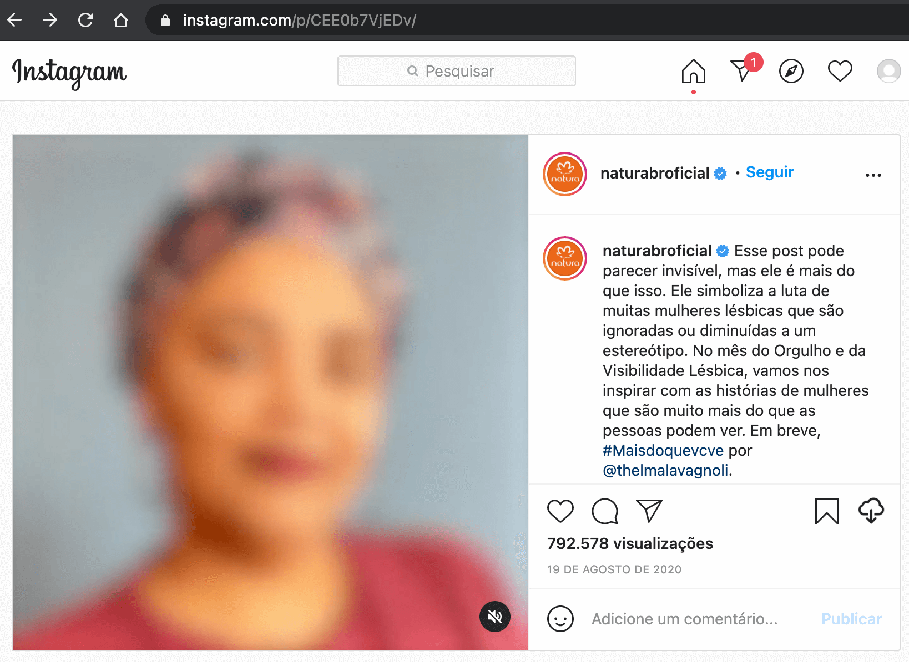
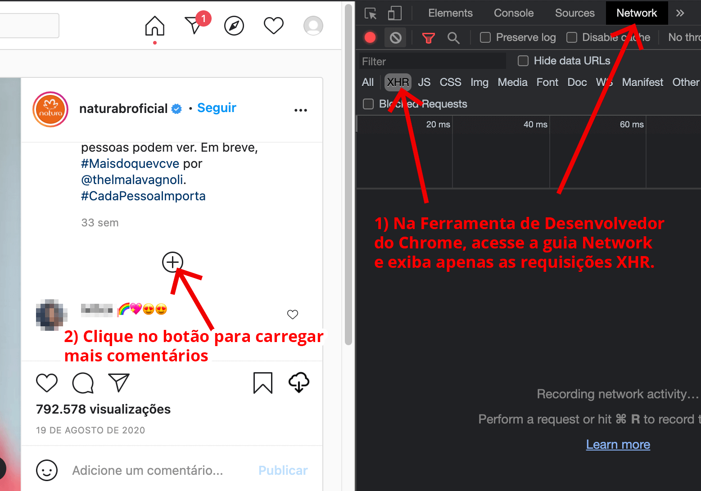
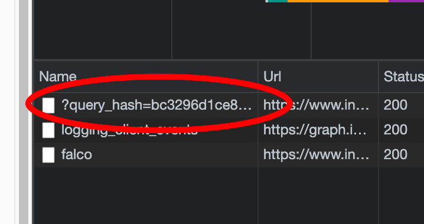
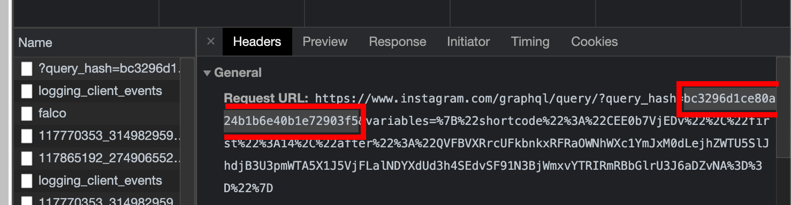
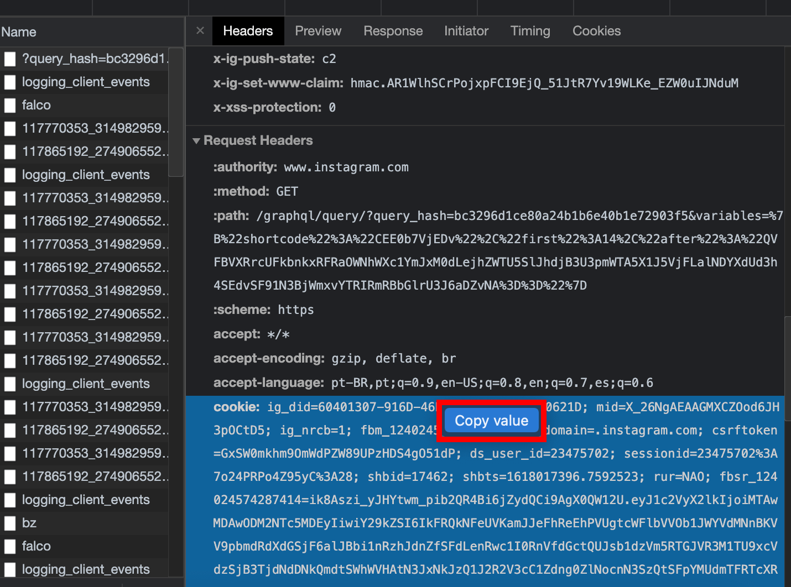

# Obtendo os valores para as variáveis *query_hash* and *cookir* 

Inicialmente, acesse o post do Instagram do qual serão extraídos os comentários.

Na página do post, habilite o painel da ferramenta de desenvolvedor no Chrome (F12 para ativar) ou em outro navegador de sua preferência.

Com o painel ativado, selecione a guia Network (Rede) e selecione apenas arquivos vindos de requisição XHR.

A partir dessa visualização, clique no botão **+** para carregar mais comentários.

Assim, é realizada uma requisição assíncrona para buscar novos comentários do post. Dentre os parâmetros enviados ao servidor, está nossa primeira variável (*query_hash*):

Clicando no arquivo da requisição, dentro da guia Headers, fica fácil copiar o valor dessa variável:

Ainda na guia Headers, role o conteúdo para baixo até chegar na seção Request Headers:

Nesta área, localize a variável *cookie* e clicando com o botão direito do mouse, clique "Copy value".

**Pronto!** Assim, tem-se os dois valores para extrair os comentários de forma automatizada.